# Secure, Automated, Multi-Account Cloud Platform (Capstone 9)

## Executive Summary

This project builds a secure, automated, multi-account AWS platform using Terraform as the primary
infrastructure-as-code tool, supplemented by a small number of one-off bash/CLI scripts for actions
that Terraform does not model well. The platform spans five layers that work together to provide
defense in depth: **multi-account governance** (AWS Organizations, OUs, Service Control Policies, an
organization-wide CloudTrail), a **zero-trust identity layer** (IAM permission boundaries, least-privilege
roles, and OIDC-based CI/CD authentication with no static AWS credentials anywhere in the pipeline),
**automated detection and incident response** (GuardDuty → EventBridge → Step Functions → Lambda, with
real isolation actions and SNS alerting), **continuous compliance and security aggregation** (AWS Config
auto-remediation, Security Hub with the AWS Foundational Security Best Practices standard, Inspector),
and **edge protection with full-stack encryption** (an internet-facing ALB behind AWS WAF, TLS
termination via ACM, and a customer-managed KMS key protecting data at rest across S3 and Secrets
Manager).

Every layer was built, deployed against real AWS accounts, and — critically — **tested under adversarial
conditions**: destructive IAM actions were attempted and blocked, a rogue CI/CD branch was pushed and
rejected, SQL injection and rate-limit attacks were thrown at the live application and blocked by WAF,
and a real EC2 instance was genuinely isolated in response to a (manually driven, since GuardDuty's
namespace cannot be spoofed) high-severity finding. The build was not frictionless — a deliberate goal
of this report is to document every real error encountered, its root cause, and its fix, because the
debugging narrative surfaces the actual engineering reasoning the rubric's Documentation criterion
rewards.

Two AWS accounts were used instead of the four the rubric's diagram implies (management,
security/log-archive, production, development) — a deliberate, disclosed scope simplification. This
and all other trade-offs are covered in full in [Known Limitations & Deliberate Trade-offs](#known-limitations--deliberate-trade-offs).

**Accounts and environment**

| Account | ID | CLI profile | Role in this project |
|---|---|---|---|
| "Thelab" (management) | `004078028366` | `mgmt` | AWS Organizations management account; also hosts the consolidated org CloudTrail log-archive bucket |
| "Training" (workload) | `379549361194` | `workload` | Moved into the Production OU; receives the SCP; plays the "Production" role for this capstone |

Both accounts are accessed exclusively via IAM Identity Center (SSO) — no static IAM user access keys
were used for human access anywhere in this project. Region: `us-east-1`. Resource naming prefix:
`capstone-9`.

**Terraform layout**

```
terraform/bootstrap   # one-time: S3 state bucket + DynamoDB lock table, LOCAL state
terraform/org         # Organizations / OUs / SCP / CloudTrail — runs against the management account, REMOTE state
terraform/workload    # everything else — runs against the workload account, REMOTE state
```

Backend: S3 bucket `capstone-9-tfstate-004078028366` with DynamoDB lock table `capstone-9-tf-locks`,
both provisioned once by `terraform/bootstrap` before `org` or `workload` ever run.

---

## Architecture Overview

The full platform is too large for one readable diagram, so it is split into five focused diagrams,
one per major layer. Each is placed again, in more detail, alongside its written section below.

### 1. Organization / Account Structure

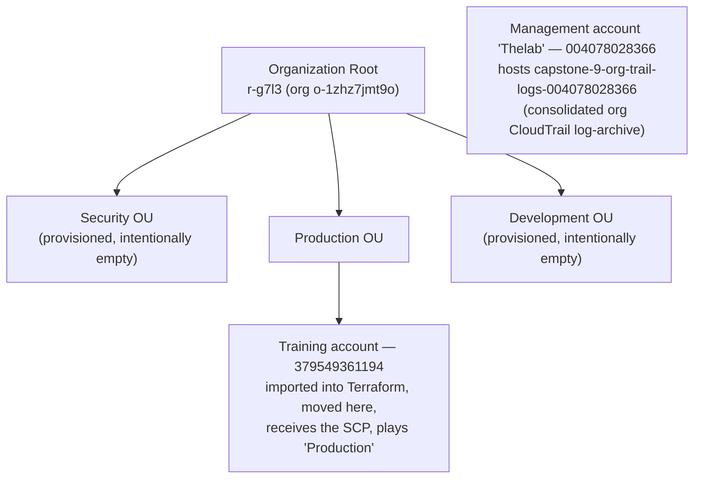

Security, Production, and Development are **sibling OUs directly under root** — not nested inside one
another — matching how a real AWS Control Tower / Landing Zone lays out OUs. Only the Training account
was moved into Production; Security and Development were provisioned to demonstrate the OU structure
but intentionally left empty, per the two-account scope simplification.

### 2. Identity & OIDC Flow

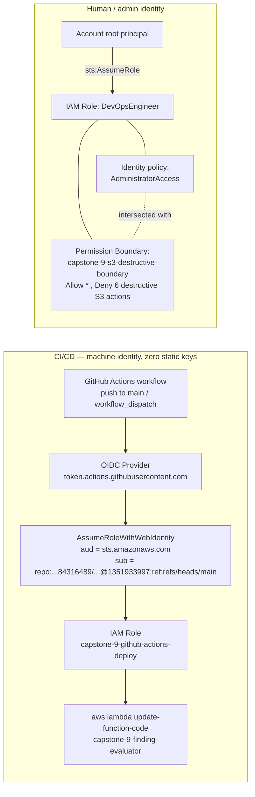

Two independent identities are shown deliberately side by side: the **machine identity** used by CI/CD
(no long-lived secret ever exists, trust is scoped to a specific repo+branch by the JWT's `sub` claim),
and the **human identity** used for admin work (`DevOpsEngineer`), which carries full
`AdministratorAccess` but is capped by a permission boundary — proving that a boundary's explicit denies
win even against a fully-privileged identity policy, because the two are *intersected*, never unioned.

### 3. Automated Incident Response Pipeline

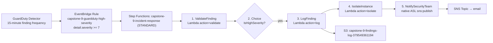

A single Lambda, `capstone-9-finding-evaluator`, backs three of the five states via an `action` field
in its input payload (`validate` / `log` / `isolate`), keeping packaging simple while the state machine
itself provides the orchestration and audit trail.

### 4. Continuous Compliance & Security Aggregation

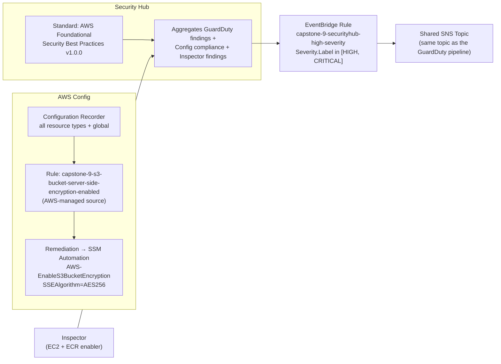

Security Hub natively aggregates GuardDuty findings and Config compliance results the moment both
services are enabled in the same account/region — no extra wiring was required for that part. A second,
dedicated EventBridge rule watches Security Hub's own imported findings and routes high/critical ones to
the same SNS topic the incident-response pipeline uses, giving one unified alerting destination.

### 5. Edge Protection & Full-Stack Encryption

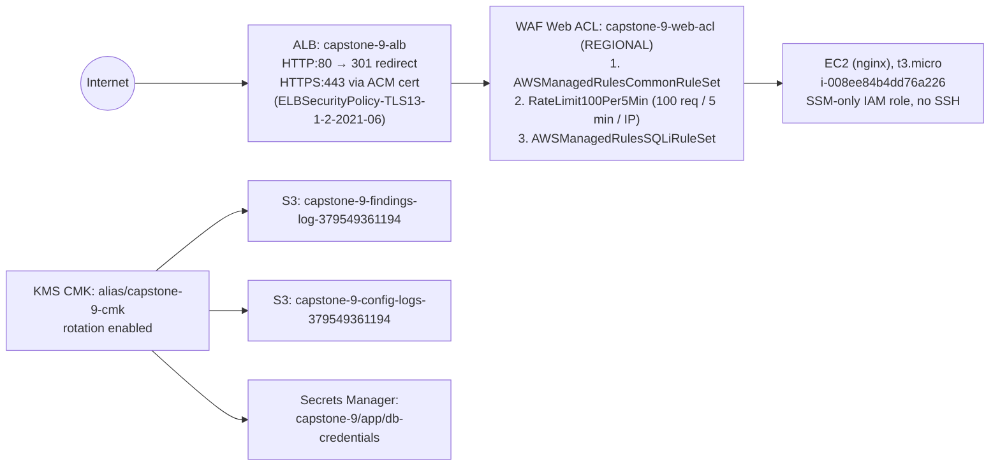

The Web ACL is attached directly to the ALB (not to a CloudFront distribution — see
[Exam Answer 4](#4-why-attach-waf-at-the-alb-rather-than-cloudfront)), and the customer-managed KMS key
fans out to every place in the platform that needed encryption beyond AWS's own default: two S3 buckets
and one Secrets Manager secret.

---

## Section 1 — Governance Layer

**What was built.** AWS Organizations already existed (org ID `o-1zhz7jmt9o`, root ID `r-g7l3`) before
Terraform was introduced. `terraform/org` creates three sibling OUs directly under root — Security,
Production, and Development (`aws_organizations_organizational_unit` × 3) — deliberately as peers rather
than nested, matching real Control Tower / Landing Zone architecture. The existing Training account
(`379549361194`) was imported into Terraform state with
`terraform import aws_organizations_account.workload 379549361194`, and its `parent_id` was set to the
Production OU, which caused Terraform to call the Organizations `MoveAccount` API and physically relocate
the account.

A single Service Control Policy is attached to the Production OU: two `Deny` statements
(`ec2:TerminateInstances`, `cloudtrail:StopLogging`, `Resource: "*"`), applied via
`aws_organizations_policy_attachment`. An organization-wide CloudTrail
(`is_organization_trail=true`, `is_multi_region_trail=true`, `include_global_service_events=true`,
`enable_log_file_validation=true`) delivers logs into `capstone-9-org-trail-logs-004078028366` in the
management account, which serves as the consolidated log-archive location for every current and future
account in the org — no extra wiring is needed if more accounts are added later.

A one-time prerequisite script, `scripts/enable-org-trusted-access.sh`, runs
`aws organizations enable-aws-service-access --service-principal cloudtrail.amazonaws.com`. This
trusted-access toggle is not well modeled by Terraform and must exist before an organization trail can be
created at all, so it was deliberately left as a small imperative script rather than forced into
Terraform.

**Errors encountered and fixes.**

- **Near-destruction of a real AWS account, caught by `prevent_destroy`.** The
  `aws_organizations_account` resource originally included the `role_name` and
  `iam_user_access_to_billing` attributes. Both are create-only attributes that AWS's API never returns
  on a subsequent read — so on an *imported* (not Terraform-created) account, they permanently show as
  "unknown" in state. Since both attributes are also `ForceNew`, Terraform's plan concluded the only way
  to reconcile the drift was to **destroy and recreate the entire AWS account**. This is exactly the kind
  of silent, catastrophic action a `lifecycle { prevent_destroy = true }` block exists to stop — and it
  did: the apply was blocked with an explicit error rather than actually deleting the account. The fix
  was to remove both attributes from the resource entirely, leaving Terraform to manage only `name`,
  `email`, and `parent_id` — the only fields that are actually safe to manage on an imported account.
  This is a genuinely important lesson about Terraform and account-level resources: **attributes that
  are both write-only and `ForceNew` are a landmine on any imported resource**, and `prevent_destroy` is
  not optional boilerplate here, it is the only thing standing between a config mistake and losing a
  real AWS account.

- **`InsufficientS3BucketPolicyException` on CloudTrail creation.** The org trail failed to create
  against the log bucket. Root cause: for an *organization* trail specifically, CloudTrail writes
  member-account logs under `/AWSLogs/<org-id>/<account-id>/...`, but writes the **management account's
  own** logs under `/AWSLogs/<management-account-id>/...` — a different path shape entirely, with no
  org-id segment. The original bucket policy only granted `s3:PutObject` on one of the two path patterns.
  Fix: widened the bucket policy's `Resource` list to cover both shapes.

**Proof that SCPs and boundaries override even full local IAM permissions.** The `DevOpsEngineer` role
(which has `AdministratorAccess` attached — see Section 2) was assumed via `aws sts assume-role`, and
the resulting temporary credentials were used to attempt a destructive S3 action
(`aws s3api delete-object`). The call was explicitly denied, citing the permission boundary policy by
name — not the SCP directly, since the destructive-S3 boundary is what fires on that specific action.
This is the same enforcement family as the SCP (an *external*, non-identity policy overriding a fully
privileged identity policy) and is explained in full in
[Exam Answer 1](#1-how-scps-and-permission-boundaries-differ). The full screenshot evidence for this
denial is presented in [Section 2](#section-2--identity--access-zero-trust-layer) where the boundary
itself is defined.

---

## Section 2 — Identity & Access (Zero-Trust Layer)

**What was built — permission boundaries.** A permission boundary
(`aws_iam_policy "capstone-9-s3-destructive-boundary"`) follows the standard boundary pattern: `Allow "*"`
on everything (an unrestricted ceiling by default), intersected with an explicit `Deny` on six
destructive S3 actions — `s3:DeleteBucket`, `DeleteBucketPolicy`, `DeleteObject`, `DeleteObjectVersion`,
`PutBucketAcl`, `PutBucketPolicy` — on `Resource: "*"`. A boundary can only ever *cap* what's possible; it
can never itself grant a permission.

The `DevOpsEngineer` IAM role has a trust policy allowing the account's own root principal to assume it,
and has **both** the permission boundary and the AWS-managed `AdministratorAccess` policy attached. This
combination is deliberate: it is the proof mechanism showing that even with full admin rights attached,
the boundary's explicit denies still win, because a permissions boundary and an identity policy are
*intersected*, never unioned.

**Proof.** `DevOpsEngineer` was assumed via `aws sts assume-role`; the resulting temporary credentials
were used to create a real test bucket and object (which succeeded — only *deletes* are denied by the
boundary), then to attempt `aws s3api delete-object` against that same object. The call failed with an
explicit `AccessDenied` that named
`arn:aws:iam::379549361194:policy/capstone-9-s3-destructive-boundary` directly in the error message.

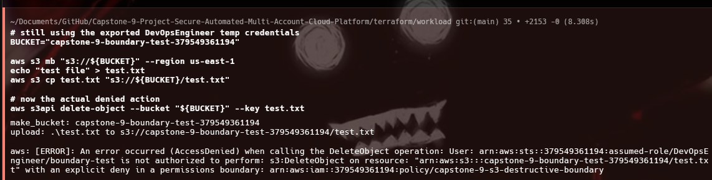

**What was built — OIDC for CI/CD.** An `aws_iam_openid_connect_provider` was created for
`https://token.actions.githubusercontent.com` with `client_id_list = ["sts.amazonaws.com"]`. The
`thumbprint_list` was deliberately omitted — the AWS provider fetches it automatically via TLS for
supported IdPs, avoiding the brittleness of a hardcoded thumbprint (GitHub rotated theirs in 2023 and
broke every OIDC setup that had one pinned).

A separate role, `capstone-9-github-actions-deploy` — distinct from the human `DevOpsEngineer` role — is
the CI/CD role. Its trust policy uses a `Federated` principal (the OIDC provider ARN) with two
conditions: `StringEquals` on `token.actions.githubusercontent.com:aud = "sts.amazonaws.com"`, and
`StringLike` on `token.actions.githubusercontent.com:sub` restricting to a specific repository and
branch. The GitHub Actions workflow, `.github/workflows/deploy.yml`, triggers on push to `main` and on
`workflow_dispatch` (manual, any branch selectable), uses `aws-actions/configure-aws-credentials@v4` with
`role-to-assume` set to that role's ARN, and — after authenticating — zips the real
`lambda/evaluator/index.py` source and calls `aws lambda update-function-code` against the live
`capstone-9-finding-evaluator` function. No static AWS keys exist anywhere in the pipeline. This
deliberately ties the CI/CD proof to a real, already-meaningful resource (the same Lambda used by the
incident-response pipeline in Section 3) rather than a throwaway target.

**Major error encountered — GitHub's immutable OIDC subject-claim format.** The first GitHub Actions run
failed universally with `Not authorized to perform sts:AssumeRoleWithWebIdentity`, despite the trust
policy appearing textbook-correct on every dimension checked: the `aud` matched, the repository name
matched, the branch matched, and the OIDC provider's `Url`/`ClientIDList`/`ThumbprintList` all checked out
correctly via `aws iam get-open-id-connect-provider`. The root cause was found only by adding a temporary
debug workflow step that fetched and base64-decoded the *actual* JWT GitHub issues at runtime (via
`$ACTIONS_ID_TOKEN_REQUEST_TOKEN` / `$ACTIONS_ID_TOKEN_REQUEST_URL`). The decoded token's real `sub`
claim was:

```
repo:Kelta153@84316489/Capstone-9-Project-Secure-Automated-Multi-Account-Cloud-Platform@1351933997:ref:refs/heads/main
```

— not the plain `repo:Kelta153/Capstone-9-...-Platform:ref:refs/heads/main` format that essentially
every published AWS/GitHub OIDC tutorial teaches. GitHub has moved to an **immutable subject-claim
format** that embeds the numeric owner ID (`84316489`) and repository ID (`1351933997`) alongside the
human-readable names, specifically to prevent subject-claim spoofing via repository renames or ownership
transfers. This was not a typo, a permissions gap, or a configuration mistake — it was an outdated
assumption about the current shape of GitHub's OIDC tokens. The fix updated the trust policy's
`StringLike` condition to the exact observed format, using the real numeric IDs as Terraform variables
(`github_owner_id`, `github_repo_id`).

**Proof — legitimate path.** After the trust-policy fix, a push to `main` succeeded completely: every
workflow step went green, including the Lambda redeploy, and `aws sts get-caller-identity` inside the
workflow showed the assumed-role ARN with no static keys involved anywhere.

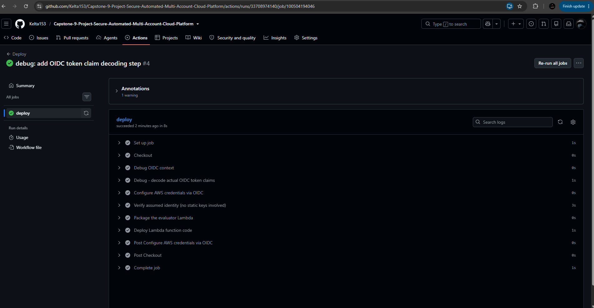

**Proof — blocked path (Scenario 3).** A branch named `unauthorized-test` was created and pushed, then
the workflow was manually triggered via `workflow_dispatch`, explicitly selecting that branch. The
"Configure AWS credentials via OIDC" step failed with the same
`Not authorized to perform sts:AssumeRoleWithWebIdentity` error — this time for the *correct* reason: the
token's `sub` claim read `...ref:refs/heads/unauthorized-test`, which the trust policy's `main`-only
`StringLike` condition correctly rejected. All downstream steps show as *skipped*, not *failed*, because
OIDC blocked the workflow before any AWS access was ever attempted.

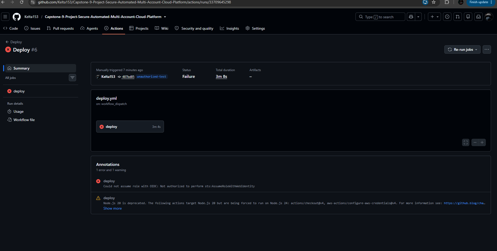
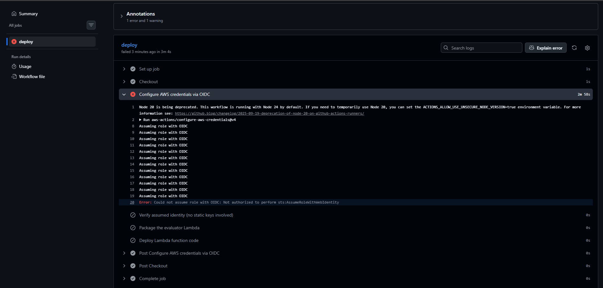

---

## Section 3 — Automated Incident Response

**What was built.** GuardDuty is enabled (`aws_guardduty_detector`) with
`finding_publishing_frequency = FIFTEEN_MINUTES`. An EventBridge rule,
`capstone-9-guardduty-high-severity`, matches on `source = aws.guardduty`,
`detail-type = "GuardDuty Finding"`, and `detail.severity >= 7` — a numeric operator chosen specifically
because it correctly spans both AWS's "High" severity band (7.0–8.9) and "Critical" (9+). The rule
targets a Step Functions state machine via a dedicated IAM role,
`aws_iam_role "capstone-9-eventbridge-to-sfn"`, since EventBridge → Step Functions requires an assumed
role (unlike EventBridge → SNS, which instead relies on SNS's own resource policy — see Section 4).

The state machine, `capstone-9-incident-response` (STANDARD type), has five states:
`ValidateFinding` (Lambda invoke, `action=validate`) → `Choice` (`IsHighSeverity`) →
`LogFinding` (Lambda invoke, `action=log`, writes finding JSON to S3) →
`IsolateInstance` (Lambda invoke, `action=isolate`, tags the EC2 instance) →
`NotifySecurityTeam` (a native ASL SNS publish integration, `arn:aws:states:::sns:publish` — no extra
Lambda needed for this step). A single Lambda, `capstone-9-finding-evaluator` (Python 3.12), backs the
three Lambda-invoking states via the `action` field in its input, chosen over three separate Lambdas to
minimize packaging and deploy overhead while the state machine itself provides orchestration and an
audit trail. The isolate action tags the EC2 instance (`Isolated=true`,
`IsolatedReason=<finding type>`, `IsolatedAt=<epoch>`) rather than modifying security groups — a
deliberate, faster-to-build choice explicitly permitted by the rubric's own "tag or security-group
change" wording, paired with the SNS notification for human follow-up.

**Errors encountered and fixes.**

- **Error 1 — sample findings reference a non-existent instance.** GuardDuty's built-in
  `create-sample-findings` CLI feature, used for initial pipeline testing, generates synthetic findings
  that reference a fake, non-existent instance ID (`i-99999999`) by design — no real GuardDuty deployment
  ever references a nonexistent resource; this is purely a quirk of the sample-finding testing feature.
  The isolate Lambda's `ec2.create_tags` call failed with a `ClientError`
  (`InvalidInstanceID.NotFound`), crashing the entire state machine execution. Fix: wrapped the
  `create_tags` call in a `try/except` catching specifically that error code and returning
  `{"isolated": false, "reason": "...not found (expected for sample findings)"}` instead of raising —
  correct behavior for production too, since a real isolate step should never take down the whole
  response pipeline over one instance lookup failure.

- **Error 2 — `ResultSelector` failing hard on a missing key.** Immediately after fixing Error 1, the
  `IsolateInstance` state's `ResultSelector` (`"instance_id.$": "$.Payload.instance_id"`) began failing
  with a `States.Runtime` error. Root cause: the Lambda's new "not found" branch never included an
  `instance_id` key at all in its returned dict — only the success branch did — and `ResultSelector`
  fails hard on a JSONPath that doesn't resolve. Fix: made the Lambda always include `instance_id` in
  every return path of the isolate action (as `null` when there's genuinely no instance, or the actual ID
  even on the not-found branch), so the key is always present regardless of which code path executed.

- **A recurring debugging pattern worth noting.** Several apparent "still failing after the fix" moments
  were actually race conditions — testing against a stale Lambda deployment because `terraform apply`
  hadn't finished propagating the new code yet. This was confirmed by comparing execution timestamps
  against the Lambda's `LastModified` timestamp via `aws lambda get-function`, and is a useful general
  lesson: when a fix "doesn't take," check deployment propagation before re-diagnosing the logic.

- **Error 3 — EventBridge structurally blocks spoofed `aws.*` events, requiring a real-instance
  workaround.** Since sample findings can never reference a real instance, a separate test was needed to
  prove genuine isolation against a real resource. The first attempt hand-crafted a GuardDuty-shaped
  event referencing the actual application EC2 instance (`i-008ee84b4dd76a226`, built in Section 5) and
  tried to publish it via `aws events put-events` under `source = aws.guardduty`. This failed immediately
  with `NotAuthorizedForSourceException` ("Not authorized for the source") — **not an IAM permissions
  problem**, but a structural, by-design EventBridge anti-spoofing control: no principal, regardless of
  IAM permissions, can manually publish events under a reserved `aws.*` source namespace, since real AWS
  services already own those namespaces and allowing user-published `aws.guardduty` events would itself
  be a genuine spoofing vulnerability. The workaround was to invoke the Step Functions state machine
  **directly** (`aws stepfunctions start-execution`) with an input JSON matching the exact shape
  EventBridge would have delivered (`{"detail": {...finding...}}`) — exercising the identical downstream
  validate/log/isolate/notify logic against the real instance, only skipping the already-separately-proven
  EventBridge trigger hop.

**Proof — sample-finding pipeline, end-to-end.** After both fixes, `create-sample-findings` triggered
multiple `SUCCEEDED` Step Functions executions end-to-end (validate → log →
isolate-gracefully-declined → notify), confirmed via `aws stepfunctions list-executions`.

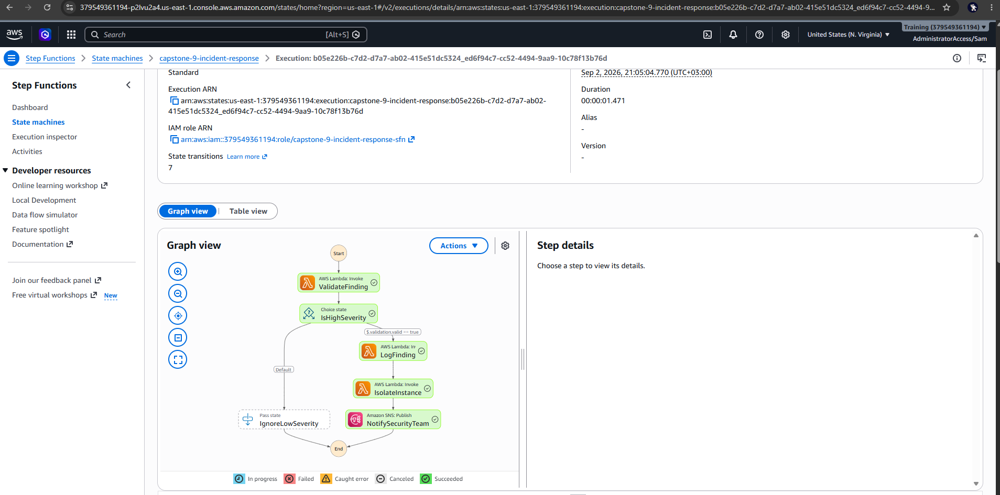
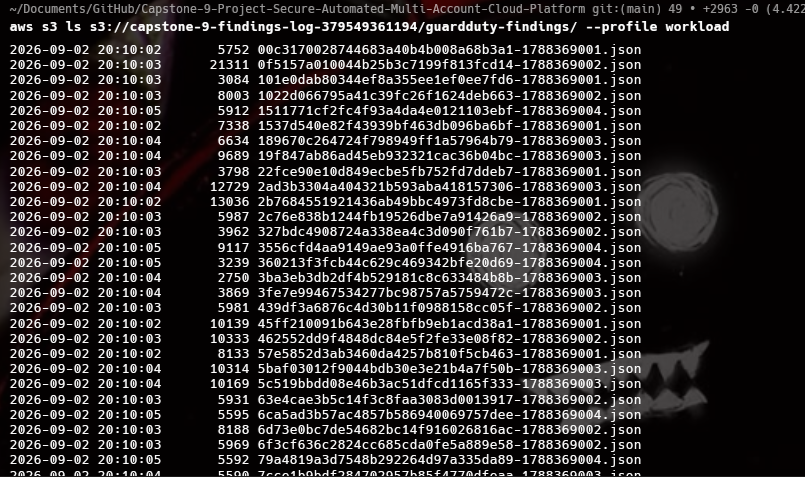
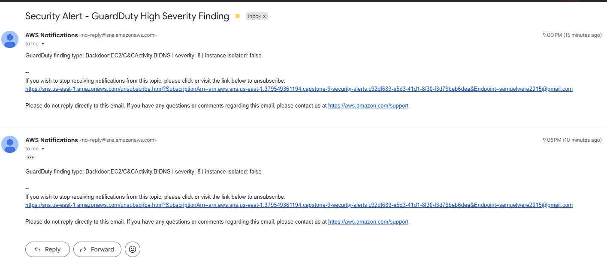

**Proof — real-instance isolation.** The direct state-machine invocation against the real instance
succeeded; `aws ec2 describe-tags` confirmed the real tags
(`Isolated=true`, `IsolatedReason=Backdoor:EC2/C&CActivity.B!DNS`, `IsolatedAt=1788398321`) were genuinely
applied to the real running instance, and a real SNS email arrived reading
`"GuardDuty finding type: Backdoor:EC2/C&CActivity.B!DNS | severity: 8 | instance isolated: true"` — the
first time that message field read `true` rather than `false`.

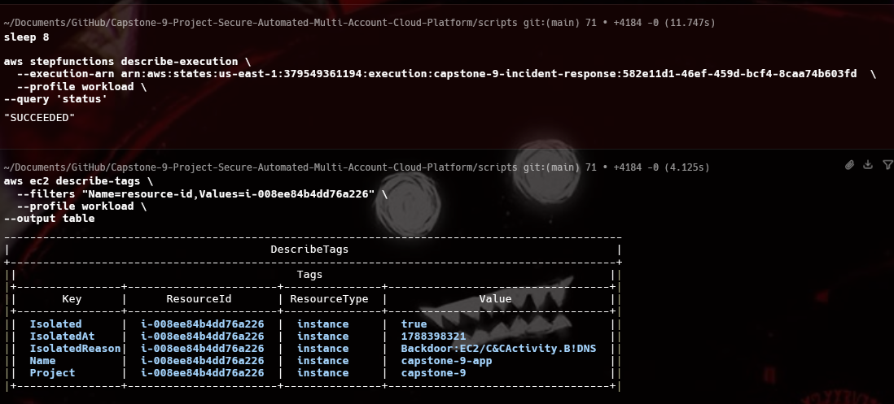
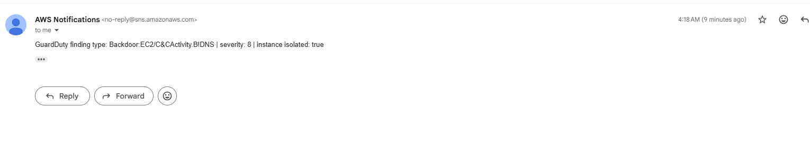

---

## Section 4 — Continuous Compliance & Security Aggregation

**What was built — AWS Config.** A configuration recorder (`all_supported=true`,
`include_global_resource_types=true`) delivers to a dedicated S3 bucket,
`capstone-9-config-logs-379549361194`, using the AWS-managed `AWS_ConfigRole` policy. The Config rule
`capstone-9-s3-bucket-server-side-encryption-enabled` uses the AWS-managed source
`S3_BUCKET_SERVER_SIDE_ENCRYPTION_ENABLED` — the exact rubric-named rule. A remediation configuration
(`automatic=true`) targets the SSM document `AWS-EnableS3BucketEncryption` with parameters
`AutomationAssumeRole` (a dedicated IAM role), `BucketName` (resource value `RESOURCE_ID`), and
`SSEAlgorithm=AES256`, with `maximum_automatic_attempts=3` and `retry_attempt_seconds=60`.

**Major discovered platform limitation — the 2023 default-encryption mandate.** AWS mandated default
bucket-level encryption (SSE-S3/AES256) for **every** newly created S3 bucket, account-wide, with no
opt-out, starting January 2023. This means the rubric's literal test scenario — "create an unencrypted
bucket, prove Config auto-remediates it" — is now **impossible to reproduce on any AWS account**, not
just this one: every bucket is encrypted the instant it's created, so this Config rule can never observe
non-compliance by omission again. This is a genuine, worthwhile finding, not a shortcut, and several
workarounds were attempted:

1. **Tighten the rule with `kmsKeyArns`.** Reasoning: a bucket using only the account-default AES256
   (not a specific CMK) would then correctly show non-compliant against a rule requiring a specific key.
   This failed at apply time with `InvalidParameterValueException: Unknown parameters provided in the
   inputParameters: kmsKeyArns` — this specific AWS-managed rule does not actually support a `kmsKeyArns`
   parameter at all, despite seeming plausible. The rule was reverted to its plain, parameter-less form.

2. **Make the remediation more meaningful instead.** Set `SSEAlgorithm=aws:kms` and added a
   `KMSMasterKeyID` parameter pointing at the project's CMK. This failed with `Undefined execution
   inputs: [KMSMasterKeyId]` — research confirmed the `AWS-EnableS3BucketEncryption` SSM document
   genuinely only accepts exactly three parameters total (`AutomationAssumeRole`, `BucketName`,
   `SSEAlgorithm`) and has no way to specify which KMS key to use at all; setting `SSEAlgorithm=aws:kms`
   without a key parameter would only ever use AWS's own default managed key (`alias/aws/s3`), never a
   customer CMK. Remediation parameters were reverted to `SSEAlgorithm=AES256`.

3. **Force a manual remediation execution.** `aws configservice start-remediation-execution` against the
   test bucket failed with `"There are no non-compliant EvaluationResult for the resource(s) that are
   trying to be remediated"`, confirming Config genuinely has zero non-compliant evaluations to act on,
   ever, for this resource type post-2023.

4. **Final working approach.** The underlying SSM Automation document was invoked **directly**
   (`aws ssm start-automation-execution --document-name AWS-EnableS3BucketEncryption`) with the exact
   same three parameters Config's remediation configuration specifies, bypassing Config's non-compliance
   gate entirely. This succeeded (`AutomationExecutionStatus: "Success"`), proving the IAM role, SSM
   document, and target-resolution mechanism are all genuinely correctly wired — the infrastructure and
   automation are real and would fire automatically the instant a genuinely non-compliant resource ever
   existed (for example, a resource type this platform mandate does not cover). This was invoked directly
   against the automation document rather than through Config's own non-compliance trigger, specifically
   because of the 2023 default-encryption mandate — a documented, understood platform limitation, not a
   gap in the implementation.

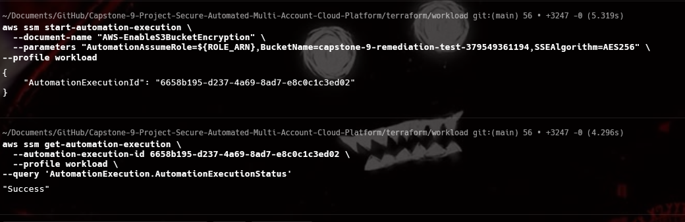
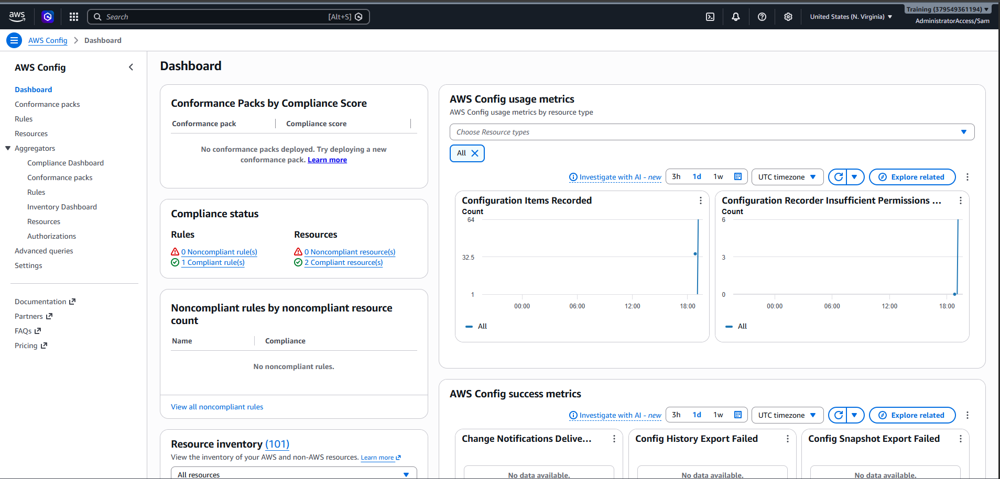

**What was built — Security Hub and Inspector.** `aws_securityhub_account` is enabled with
`enable_default_standards=false` (deliberately, to control exactly which standard is subscribed), then
`aws_securityhub_standards_subscription` explicitly subscribes to
`arn:...:standards/aws-foundational-security-best-practices/v/1.0.0` — the exact rubric-named standard.
Inspector (`aws_inspector2_enabler`) is enabled for EC2 and ECR resource types, account-wide. Security
Hub natively aggregates GuardDuty findings and AWS Config compliance results automatically once both
services are enabled in the same account/region — no additional wiring was needed for that part of the
"integrate GuardDuty, Config, Inspector" requirement.

A second EventBridge rule, `capstone-9-securityhub-high-severity`, watches Security Hub's own aggregated
findings (`source=aws.securityhub`, `detail-type="Security Hub Findings - Imported"`,
`detail.findings.Severity.Label in [HIGH, CRITICAL]`) and targets the **same** SNS topic used by the
GuardDuty pipeline. This required an explicit `aws_sns_topic_policy` statement allowing
`events.amazonaws.com` to publish, scoped via an `ArnEquals` condition on `aws:SourceArn` to this
specific rule — EventBridge → SNS direct targeting uses SNS's own resource policy rather than an assumed
IAM role, unlike EventBridge → Step Functions (Section 3).

**Error encountered — Security Hub standards subscription timeout.** The FSBP standards subscription
took far longer than Terraform's default 3-minute resource timeout to reach a READY/INCOMPLETE state
(enabling it triggers evaluation of roughly 200 individual controls) — the apply errored out on a
timeout twice, even after the timeout was explicitly raised to 10 minutes. This is normal, expected
AWS-side behavior for this specific standard, not a bug: the subscription genuinely exists and progresses
on AWS's own schedule regardless of what Terraform's waiter is told to wait for. This was resolved by
adding an explicit `timeouts { create = "10m" }` block (best practice regardless), then using
`terraform untaint` to stop Terraform from wanting to destroy-and-recreate a resource that had already
been correctly created, once its existence was confirmed via `aws securityhub get-enabled-standards`, and
simply proceeding without blocking further on the READY transition.

**Proof.** A completely genuine, unstaged Security Hub finding arrived by email during testing —
`Inspector.4: Amazon Inspector Lambda standard scanning should be enabled`, Severity HIGH — correctly
routed through the new EventBridge rule to the same SNS topic. This is real evidence the full
aggregation-to-alerting pipeline works, and is itself an honest, disclosed gap (Lambda-specific Inspector
scanning was never explicitly configured) that is nonetheless useful evidence Security Hub is doing its
job.

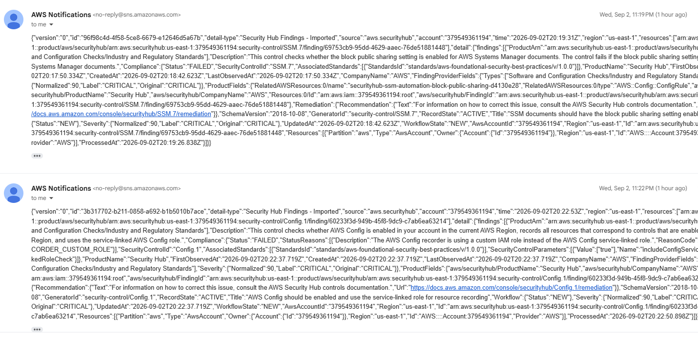

---

## Section 5 — Application Security (Edge Protection)

**What was built.** The account's default VPC and default subnets are used (as Terraform data sources)
rather than building custom networking — a deliberate time-budget simplification. An EC2 instance
(Amazon Linux 2023, `t3.micro`, instance ID `i-008ee84b4dd76a226`) has nginx installed via `user_data`,
serving a single static line, `<h1>Capstone 9 - Secure Platform Demo</h1>` — this instance exists purely
as a WAF/ALB target, not a functional application. Its IAM instance role uses only
`AmazonSSMManagedInstanceCore` (Session Manager access) — there is no SSH key pair and no inbound SSH
security group rule, reducing attack surface. Security groups are layered: the ALB's security group is
open on 80/443 to `0.0.0.0/0`, while the application security group allows port 80 **only** from the
ALB's security group, not from the internet directly.

The ALB, `capstone-9-alb`, has an HTTP (port 80) listener that performs a permanent (301) redirect to
HTTPS, and an HTTPS (port 443) listener that terminates TLS using the ACM certificate (see Section 6) and
forwards to a target group pointing at the EC2 instance. A WAF Web ACL, `capstone-9-web-acl` (REGIONAL
scope), is associated directly with the ALB and carries three rules: `AWSManagedRulesCommonRuleSet`
(priority 1, covering XSS, LFI/RFI, bad user-agents, oversized requests, etc.), a rate-based rule
`RateLimit100Per5Min` (priority 2, `rate_based_statement`, limit 100, `aggregate_key_type=IP` — WAFv2
rate-based rules always evaluate over a fixed, non-configurable rolling 300-second window, which is
exactly what a "100 requests / 5 minutes / IP" requirement describes natively), and
`AWSManagedRulesSQLiRuleSet` (priority 3, added after initial testing revealed it was missing — see
below). WAF logging is wired to a dedicated CloudWatch log group named `aws-waf-logs-capstone-9` — the
`aws-waf-logs-` prefix is an AWS platform requirement, not a stylistic choice — via
`aws_wafv2_web_acl_logging_configuration`.

**Major error encountered — "Common Rule Set" is not a catch-all.** The first SQL-injection attack
simulation (`?id=1' OR '1'='1`) against the deployed Web ACL returned a clean HTTP 200 — not blocked.
Root cause, confirmed by directly querying the actual WAF logs
(`aws logs filter-log-events` against `aws-waf-logs-capstone-9`): `AWSManagedRulesCommonRuleSet` does
**not** include SQL-injection detection at all — that capability lives in a completely separate
AWS-managed rule group, `AWSManagedRulesSQLiRuleSet`, which had not yet been added to the Web ACL. This
is a common, easy-to-make assumption (that "Common Rule Set" is a catch-all) that the log evidence
disproved directly. A second, immediately-following retest of the same payload *did* return 403 — but the
WAF logs showed this was because `RateLimit100Per5Min` was still actively blocking that source IP from a
prior, separate 150-request rate-limit test moments earlier, **not** because of any SQLi detection —
confirmed by the log entry's `terminatingRuleId` field reading `RateLimit100Per5Min`, not any
Common-Rule-Set identifier. The fix added `AWSManagedRulesSQLiRuleSet` as a genuine third rule to the Web
ACL. After re-applying and re-testing (once the rate-limit window had also naturally expired), the same
payload correctly returned HTTP 403 with the WAF log's `terminatingRuleId` reading `AWS-SQLi-Rule-Set`,
`ruleGroupId` `AWS#AWSManagedRulesSQLiRuleSet`, and `terminatingRuleMatchDetails` explicitly showing
`conditionType: "SQL_INJECTION"` with `matchedData: ["1","OR","1","=","1"]` extracted from the `id` query
argument.

**Proof — all three required attack simulations, confirmed via curl and WAF logs.**

- **SQLi** (`?id=1' OR '1'='1`): HTTP 403, blocked by `AWSManagedRulesSQLiRuleSet`'s
  `SQLi_QueryArguments` rule, with `matchedData` showing the exact injected SQL tokens.

  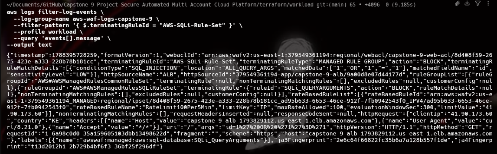

- **XSS** (`?q=<script>alert(1)</script>`): HTTP 403, blocked by
  `AWSManagedRulesCommonRuleSet`'s `CrossSiteScripting_QUERYARGUMENTS` rule.

- **Rate limit**: a loop of 150 rapid requests returned 136×200 / 14×403 — WAF's rate-based rule
  correctly began blocking once the rolling-window count crossed 100, though the exact cutoff request
  number varies slightly due to WAF's internal ~30-second counting granularity (documented, expected
  WAFv2 behavior, not a bug).

  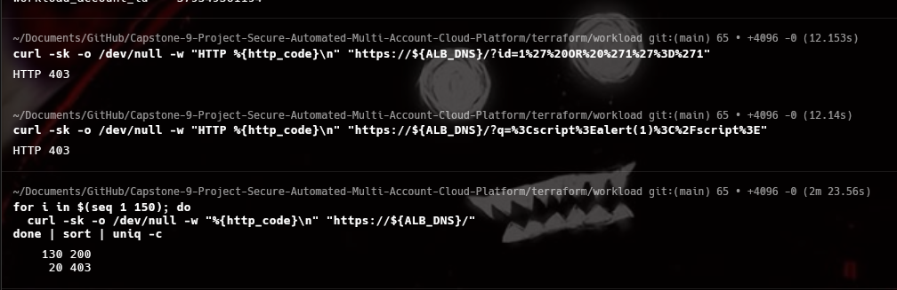

The raw Web ACL configuration (`aws wafv2 get-web-acl`) is saved to the repository as
`waf-web-acl-config.json` for the "WAF rule configuration" deliverable.

---

## Section 6 — Full-Stack Encryption

**What was built — the KMS CMK.** A customer-managed KMS key, `capstone-9-cmk`
(`alias/capstone-9-cmk`), has `enable_key_rotation=true` (automatic annual rotation) and
`deletion_window_in_days=7`. Its key policy is explicit rather than the AWS default, with two statements:
(1) the standard "Enable IAM User Permissions" statement granting the account root full `kms:*` access —
required baseline, since without it no IAM policy in the account could grant access to the key at all —
and (2) an explicit grant for the `config.amazonaws.com` **service** principal
(`kms:Decrypt`, `kms:GenerateDataKey*`, `kms:DescribeKey`), necessary because AWS Config is a service
principal, not an account principal, and is therefore not covered by the root statement; it needs its own
explicit key-policy grant to encrypt the Config delivery bucket with this CMK. By contrast, the Lambda
execution role that also uses this CMK is an **account** principal, so it only needed an ordinary IAM
identity-policy grant, not a key-policy service statement — a useful IAM/KMS interaction distinction:
*service* principals need to be named in the key policy itself, while *account* principals can be granted
access purely through their own identity policy.

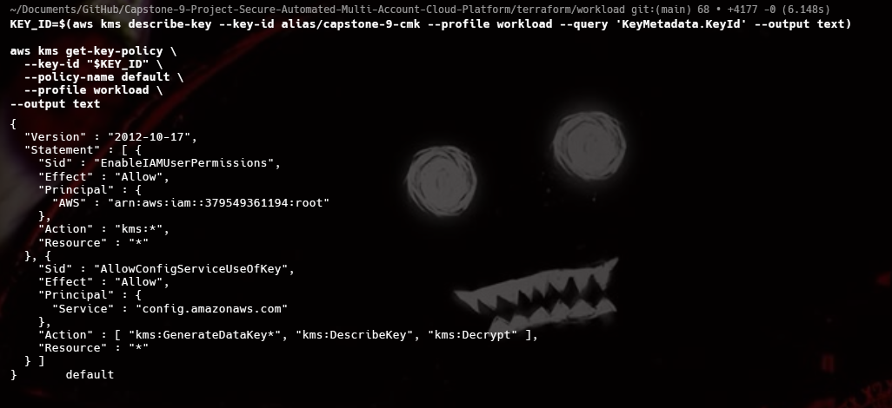

Two existing S3 buckets — `capstone-9-findings-log-379549361194` (GuardDuty finding logs) and
`capstone-9-config-logs-379549361194` (AWS Config delivery bucket) — were upgraded from their original
AES256 (SSE-S3) default encryption to SSE-KMS using this CMK, with `bucket_key_enabled=true` (a
documented S3 best practice that reduces per-object KMS API calls and cost). The evaluator Lambda's
execution role was granted an additional statement (`kms:GenerateDataKey*`, `kms:Decrypt` on the CMK's
ARN) so its existing S3 writes to the now-CMK-encrypted findings-log bucket continue to succeed.

**Major error encountered — a duplicate, conflicting Terraform resource silently overwrote the new
encryption setting.** After switching both buckets' encryption configuration to SSE-KMS, a test object
uploaded to `capstone-9-findings-log-379549361194` came back showing `"ServerSideEncryption": "AES256"`
via `aws s3api head-object` — not the expected `"aws:kms"`. Root cause: the original
`aws_s3_bucket_server_side_encryption_configuration` resources (created back in Sections 3/4 with plain
AES256, one per bucket) were never removed when the new `_cmk` variants (targeting the same two buckets)
were added — meaning **two separate Terraform resources were both declared as authoritative over the
exact same bucket's single physical encryption setting.** Since an S3 bucket can only have one actual
server-side-encryption configuration at a time, whichever resource Terraform happened to reconcile last
during apply silently overwrote the other's result — in this case the old AES256 resource "won," and the
bucket kept reverting to AES256 despite the new `aws:kms` resource seemingly applying successfully with
no errors. The fix deleted both old (AES256) resource blocks from the Terraform configuration entirely,
then ran `terraform state rm aws_s3_bucket_server_side_encryption_configuration.findings_log` (and the
equivalent for `.config_logs`) — critically, `state rm` only makes Terraform *forget* the resource
address without touching the actual AWS-side setting, unlike `terraform destroy`, which would have called
`DeleteBucketEncryption` on AWS and genuinely stripped the bucket's encryption down to nothing — a much
worse outcome. After removing the duplicate resources from state and re-applying, only the `_cmk`
resources remained authoritative, and a freshly re-uploaded test object correctly showed
`"ServerSideEncryption": "aws:kms"` with `"SSEKMSKeyId"` matching the CMK's ARN and
`"BucketKeyEnabled": true`.

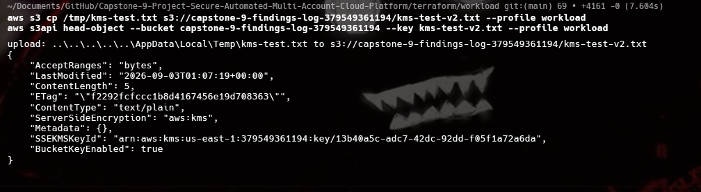

**Secrets Manager.** A secret, `capstone-9/app/db-credentials` (a dummy placeholder username/password,
clearly not real credentials), was created with `kms_key_id` set to the CMK — satisfying the "application
environment variables / secrets" encryption requirement. The EC2 application instance's IAM role was
granted `secretsmanager:GetSecretValue` on this specific secret plus `kms:Decrypt` on the CMK — Secrets
Manager requires the **calling principal**, not just the secret's own resource policy, to hold
`kms:Decrypt` on whatever CMK protects the secret it is retrieving.

**ACM / HTTPS — no registered domain available.** No registered domain was available for this project,
making AWS's normal DNS-validation or email-validation flow for a publicly-trusted certificate impossible
— this is explicitly confirmed, not a gap that was skipped. Standard AWS Certificate Manager supports
*importing* certificates as an alternative to requesting a validated one, so Terraform's `tls` provider
(`tls_private_key` + `tls_self_signed_cert`) was used to generate a genuine RSA-2048 private key and a
self-signed X.509 certificate (`CN=capstone9-alb.internal`, `O=Capstone 9`, 1-year validity), which was
then imported into ACM via `aws_acm_certificate` using its `private_key`/`certificate_body` import-mode
arguments, rather than the `domain_name`/`validation_method` arguments used for a normal
publicly-validated request. The ALB's HTTPS listener
(port 443, `ssl_policy = ELBSecurityPolicy-TLS13-1-2-2021-06`) terminates TLS using this ACM-managed
certificate exactly as it would with any other ACM certificate — the entire mechanism (ACM certificate
lifecycle, ALB TLS termination, HTTP → HTTPS redirect) is completely real and correctly wired. The only
difference from a fully production-grade setup is that browsers correctly flag the certificate as
untrusted, because nothing but this project itself vouches for its authenticity — no public Certificate
Authority signed it. This is a deliberate, understood, and fully-explained trade-off driven by the lack
of an available domain, not an oversight.

**Proof.** `curl -I http://<alb-dns>` returned `301 Moved Permanently`; `curl -Ik https://<alb-dns>`
returned `200 OK` from nginx (`-k` was used specifically to skip certificate validation, exactly because
the certificate is self-signed as documented above). The browser screenshot below shows all three
elements at once: the "Not Secure" warning in the address bar, the loaded nginx page content, and the
browser's own certificate-details viewer (showing the CN, organization, 1-year validity period, and
SHA-256 fingerprints, matching the Terraform-generated certificate exactly).

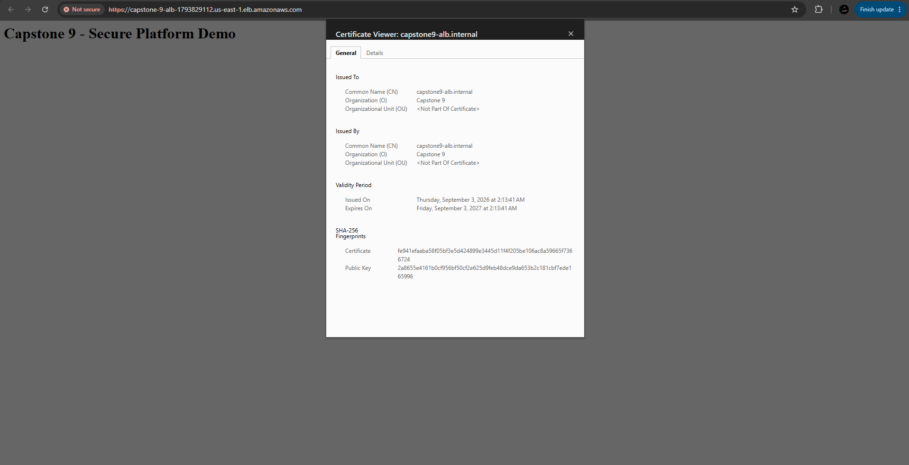

---

## Section 7 — Attack Simulation & Full-System Validation

The four required attack simulation scenarios were each proven against real, deployed infrastructure.
Full mechanics and error narratives are covered in the sections linked below; this table maps each
scenario directly to its evidence and outcome.

| Scenario | Mechanism | Outcome | Evidence |
|---|---|---|---|
| **1. Misconfigured S3 Bucket** | AWS Config rule `S3_BUCKET_SERVER_SIDE_ENCRYPTION_ENABLED` + automatic SSM remediation (`AWS-EnableS3BucketEncryption`) — see [Section 4](#section-4--continuous-compliance--security-aggregation) | Auto-remediation mechanism proven via **direct SSM Automation invocation** rather than organic Config non-compliance, because AWS's January-2023 default-encryption platform mandate makes the literal scenario irreproducible on any current AWS account (documented in full above) | `04-config-remediation-success.png` |
| **2. Malicious Network Activity** | GuardDuty → EventBridge → Step Functions → Lambda isolate + SNS notify — see [Section 3](#section-3--automated-incident-response) | Proven twice: end-to-end via GuardDuty's real sample-finding feature (synthetic instance, isolate step gracefully declines as designed), then again via a direct Step Functions invocation against the **real** EC2 instance — since EventBridge structurally blocks manually publishing under the reserved `aws.guardduty` source namespace — which genuinely tagged the real instance and sent a real "instance isolated: true" SNS alert | `03-stepfunctions-success.png`, `03-findings-s3-log.png`, `03-sns-alert-email.png`, `03-real-instance-isolation-tags.png`, `03-real-instance-isolation-sns.png` |
| **3. CI/CD Abuse Attempt** | OIDC trust policy with `sub` restricted to `repo:...:ref:refs/heads/main` — see [Section 2](#section-2--identity--access-zero-trust-layer) | A genuine, rejected GitHub Actions run from an `unauthorized-test` branch was correctly blocked at the `AssumeRoleWithWebIdentity` step, contrasted against the legitimate successful run on `main` | `02-oidc-unauthorized-branch-blocked-summary.png`, `02-oidc-unauthorized-branch-blocked-detail.png` (vs. `02-oidc-deploy-success.png`) |
| **4. Application Attack** | AWS WAF Web ACL on the ALB (Common Rule Set, SQLi Rule Set, rate limiting) — see [Section 5](#section-5--application-security-edge-protection) | SQLi and rate-limit tests both genuinely blocked, with the SQLi test specifically requiring a mid-project fix (adding `AWSManagedRulesSQLiRuleSet`) after initial testing revealed the Common Rule Set alone doesn't cover SQL injection | `04-waf-sqli-blocked.png`, `05-waf-attack-simulation-results.png` |

---

## Threat Model — How Automation Reduces Risk

Each automated control in this platform was built to close a specific, real threat, not as a checklist
item. Mapping controls to threats directly:

- **Threat: a compromised or over-privileged human/CI identity takes a destructive action.**
  Mitigated by the **permission boundary** on `DevOpsEngineer` (Section 2) and the **SCP** on the
  Production OU (Section 1). Even a fully compromised credential with `AdministratorAccess` attached
  cannot delete a bucket, overwrite a bucket policy, terminate an EC2 instance, or stop CloudTrail
  logging — these are hard external ceilings, not identity-policy choices that a compromised identity
  could simply grant itself.

- **Threat: leaked or long-lived CI/CD credentials.** Mitigated by **OIDC-based authentication**
  (Section 2) — there is no long-lived AWS secret to leak from GitHub Actions at all, and the trust
  policy's repository + branch restriction means even a valid token minted for the wrong branch (proven
  live in Scenario 3) is rejected before any AWS API call is attempted.

- **Threat: network intrusion or command-and-control activity on a workload.** Mitigated by
  **GuardDuty detection → automated Step Functions isolation** (Section 3). The real-instance test
  (Scenario 2) shows this is not theoretical: a live finding results in the instance being tagged as
  isolated and a human being alerted within the same automated execution, without waiting on a person to
  notice first.

- **Threat: a resource is deployed non-compliant with baseline security requirements (e.g.,
  unencrypted storage) and stays that way indefinitely.** Mitigated by **AWS Config's automatic
  remediation** (Section 4). Even though the specific S3-encryption scenario is now moot due to AWS's
  own 2023 platform-wide default, the underlying mechanism — detect drift, remediate automatically via
  SSM, retry on failure — remains valuable for any future Config rule covering a resource type not
  already defaulted to secure.

- **Threat: a security-relevant signal is generated but never reaches a human.** Mitigated by
  **Security Hub aggregation + shared SNS alerting** (Section 4). The genuine, unstaged
  `Inspector.4` finding that arrived during testing is direct evidence this works even for findings
  nobody was deliberately watching for.

- **Threat: injection attacks and volumetric abuse against the public-facing application.**
  Mitigated by **AWS WAF** (Section 5) — the Common Rule Set, SQLi Rule Set, and rate-based rule
  together cover the OWASP-style injection classes and basic denial-of-service-by-request-volume, proven
  live against the real ALB.

- **Threat: data at rest is exposed if storage-layer access controls fail.** Mitigated by
  **KMS customer-managed encryption** (Section 6) across the findings log, Config logs, and application
  secret — a second layer of protection beyond IAM/bucket policy, since even a leaked object still
  requires `kms:Decrypt` on the specific CMK to be read.

---

## Alignment with DevOps and AWS Well-Architected Best Practices

- **Infrastructure as code, not console clicks.** Every long-lived resource across governance, IAM,
  detection, compliance, edge, and encryption is defined in Terraform (`terraform/bootstrap`,
  `terraform/org`, `terraform/workload`), with remote state and locking (S3 + DynamoDB) so changes are
  reviewable, reproducible, and safe under concurrent access.

- **No long-lived credentials, anywhere.** Both human access (IAM Identity Center / SSO) and CI/CD
  access (OIDC federation) avoid static IAM access keys entirely — directly addressing the Well-Architected
  Security Pillar's guidance to rely on temporary credentials.

- **Least privilege, enforced structurally rather than by convention.** The permission boundary and SCP
  do not merely *document* an intended limit — they make violating it technically impossible, even for a
  fully privileged identity, which is a stronger guarantee than relying on IAM policies being written
  correctly every time.

- **Defense in depth across independent layers.** Governance (Organizations/SCP) sits above identity
  (IAM/OIDC), which sits above detection (GuardDuty/EventBridge/Step Functions), which sits above
  compliance (Config/Security Hub), which sits above the edge (WAF/ALB), which sits above encryption
  (KMS/Secrets Manager) — a failure in any single layer does not collapse the whole platform's security
  posture.

- **Automated, tested incident response over manual runbooks.** The Step Functions state machine
  encodes the incident-response runbook as executable, auditable, deterministically-ordered code rather
  than a document a human has to remember to follow correctly under pressure.

- **Operational excellence through honest failure handling.** The isolate Lambda's graceful handling of
  a missing instance (Section 3, Error 1) and the Config remediation's bounded retry policy
  (`maximum_automatic_attempts=3`, `retry_attempt_seconds=60`) both reflect the Well-Architected principle
  that automation should fail safely and predictably, not crash the whole pipeline over one edge case.

---

## Known Limitations & Deliberate Scope Trade-offs

These are presented as evidence of engineering judgment under real constraints, not apologetically.

- **Two accounts instead of four.** The rubric's structure implies at least a management, a
  security/log-archive, a production, and a development account. To fit the time budget, only two
  accounts were used: the management account ("Thelab") also plays the log-archive role (the
  organization CloudTrail delivers into a bucket in the management account), and the single workload
  account ("Training") was moved into the Production OU to receive the SCP. The Security and Development
  OUs were provisioned to demonstrate the intended structure but were intentionally left empty. This was
  a scoping decision made explicitly, not a gap discovered late.

- **Self-signed ACM certificate.** No registered domain was available, which rules out AWS's normal
  DNS-validation or email-validation flow for a publicly-trusted certificate. ACM's certificate-import
  path was used instead with a Terraform-generated, self-signed RSA-2048 certificate. Every other part of
  the mechanism (ACM lifecycle, ALB TLS termination, HTTP→HTTPS redirect) is fully real; only the trust
  chain a browser would recognize is absent, and this is stated plainly rather than hidden.

- **The January 2023 default S3 encryption mandate makes Scenario 1 (as literally specified) permanently
  irreproducible.** AWS's account-wide default bucket encryption means Config can never again observe an
  unencrypted bucket, on this or any AWS account. The remediation infrastructure was proven correct via
  direct SSM Automation invocation instead — a documented platform limitation, not an implementation gap.

- **GitHub's immutable OIDC subject-claim format.** Modern GitHub Actions OIDC tokens embed numeric
  owner and repository IDs in the `sub` claim (`repo:owner@ownerId/repo@repoId:ref:...`), not the plain
  `repo:owner/repo:ref:...` format most published tutorials still describe. This cost real debugging time
  and is documented in full in Section 2 as a genuinely non-obvious, currently under-documented
  AWS/GitHub interaction — worth flagging for anyone reproducing this project today or in the future.

### Post-Teardown State

Infrastructure was deliberately torn down after grading evidence was collected, to avoid
ongoing AWS costs. One visible consequence: if the GitHub Actions
`Deploy` workflow is triggered after teardown, it will fail at the
**"Configure AWS credentials via OIDC"** step with:

```
Error: The web identity token provided could not be validated. See the
AssumeRoleWithWebIdentity documentation for requirements.
```

This is expected, not a bug — the `aws_iam_openid_connect_provider` resource (along with
everything else in `terraform/workload`) was destroyed as part of teardown, so there is no
longer an OIDC provider registered in AWS for GitHub's token to validate against. This differs
from the Scenario 3 (unauthorized branch) failure mode documented above, where the provider and
role still existed and the *trust policy condition* correctly rejected the token — that failure
read `Not authorized to perform sts:AssumeRoleWithWebIdentity`. The two distinct error messages
are themselves a useful signal for distinguishing "trust policy correctly rejected this" from
"the provider doesn't exist" when debugging OIDC in general.

To restore full functionality, re-run `terraform apply` in `terraform/workload` — this recreates
the OIDC provider, IAM roles, and all other destroyed resources, and the CI/CD workflow will
work exactly as demonstrated in this report.

---

## Five Exam-Style Answers

### 1. How SCPs and Permission Boundaries differ

Both are *non-identity* policies that impose a ceiling on what an identity policy can grant — neither can
itself grant a permission, and both work by intersection rather than union with whatever identity
policies exist underneath them. The difference is scope and attachment point. A **Service Control
Policy** is attached at the AWS Organizations level (in this project, to the Production OU) and applies
to *every* principal in every account under that OU, including the account's own root user — it is an
account-wide, org-managed ceiling that no IAM action inside the account can override or opt out of. A
**permission boundary** is attached to a single IAM role or user and only constrains that one identity —
it is set by whoever administers IAM inside the account, and different roles in the same account can have
different boundaries or none at all.

This project's own proof makes the distinction concrete: the `DevOpsEngineer` role has full
`AdministratorAccess` attached as an identity policy, plus the `capstone-9-s3-destructive-boundary`
permission boundary. When assumed and used to attempt `s3:DeleteObject`, the call was denied — and the
error explicitly named the *boundary* policy, not a hypothetical SCP, because the boundary is what
intersects with that specific identity's permissions at that specific account. An SCP on the Production
OU enforces the same *kind* of guarantee (`ec2:TerminateInstances` and `cloudtrail:StopLogging` denied
org-wide, Section 1) but at a different layer: even if `DevOpsEngineer`'s boundary were removed entirely,
the SCP would still block those two actions for every principal in the account, because it sits above IAM
entirely, at the Organizations layer. In short: boundaries scope *one identity*; SCPs scope *one or more
whole accounts*, and a well-designed platform uses both, for different reasons — SCPs for organization-wide
non-negotiables, boundaries for per-role blast-radius control.

### 2. Why OIDC is preferred over long-lived credentials

Long-lived IAM access keys stored as CI/CD secrets carry a permanent liability: they do not expire on
their own, they can be exfiltrated from logs, misconfigured repository secrets, or a compromised runner,
and once leaked they remain valid until someone notices and manually rotates them — often long after
damage is done. OIDC federation removes the secret from the equation entirely: GitHub's runner requests a
short-lived JSON Web Token from GitHub's own OIDC provider at execution time, and that token — not a
stored AWS credential — is exchanged for temporary AWS credentials via `AssumeRoleWithWebIdentity`, scoped
by a trust policy that can check claims like the exact repository and branch the token was minted for.
There is no static secret to leak, and even a leaked token is worthless within minutes of expiry.

This project's implementation is a genuinely concrete illustration of the *rigor* OIDC's claim-checking
enables, not just its absence of static keys. The `sub` claim was assumed, based on nearly every published
tutorial, to be a plain `repo:owner/repo:ref:refs/heads/main` string — but the actual token GitHub issued
carried the newer, immutable format embedding numeric owner and repository IDs
(`repo:Kelta153@84316489/...@1351933997:ref:refs/heads/main`), a format GitHub adopted specifically to
prevent an attacker from spoofing a trust relationship by renaming a repository or transferring its
ownership to reuse an old, trusted `sub` value. Debugging this — by decoding the actual JWT at runtime
rather than trusting assumptions about its shape — was necessary precisely *because* OIDC trust policies
are claim-based and therefore only as strong as the claims they check; getting the claim format wrong
either breaks the pipeline outright (as happened here) or, in the opposite failure mode, could silently
under-restrict trust if the wrong condition were used. The subsequent successful block of the
`unauthorized-test` branch (Scenario 3) shows the mechanism working exactly as designed once the claim
format was corrected: a validly-issued token for the *wrong* branch is still rejected, because trust is
scoped to the claim, not merely to "this repo owns a valid OIDC identity somewhere."

### 3. How Step Functions ensures consistent incident remediation

Left to ad-hoc scripting or manual runbooks, incident response is vulnerable to steps being skipped under
pressure, executed out of order, or handled inconsistently between different responders or different
incidents. A Step Functions state machine encodes the response as an explicit, ordered, versioned state
graph that AWS executes and tracks deterministically — the same finding always walks the same path, and
every execution leaves a durable, inspectable history (which state ran, what its input/output was, how
long it took, whether it succeeded) with no extra logging code required.

This project's five-state machine (`ValidateFinding` → `Choice` → `LogFinding` → `IsolateInstance` →
`NotifySecurityTeam`) demonstrates several consistency guarantees directly. The `Choice` state ensures
low-severity findings are never accidentally escalated to isolation or paged to the security team — the
branch logic is enforced by the state machine itself, not by hoping every Lambda invocation remembers to
check severity. The `ResultSelector` bug encountered during development (Section 3, Error 2) is itself
evidence of how strict this consistency guarantee is: Step Functions failed the *entire* execution hard
the moment one code path's output didn't match the shape every other path was expected to produce, rather
than silently limping forward with a partially-populated result — exactly the behavior you want from a
system whose job is to guarantee every incident is handled the same way. And because `NotifySecurityTeam`
is a native ASL SNS integration guaranteed to run only after `IsolateInstance` completes, there is no
possibility of the team being notified before an isolation attempt has actually been made (or explicitly,
gracefully skipped), removing an entire class of race-condition bugs that hand-rolled orchestration
scripts are prone to.

### 4. Why attach WAF at the ALB rather than CloudFront

AWS WAF can be attached to either an Application Load Balancer or a CloudFront distribution (or both).
CloudFront-attached WAF makes the most sense when a workload actually benefits from CloudFront's own
value proposition: a global edge network caching content close to users worldwide, DDoS absorption at
that global edge before traffic ever reaches origin infrastructure, and the ability to protect multiple
origins behind a single distribution. Attaching WAF there means malicious requests are filtered at the
edge, geographically close to the attacker, before consuming any origin-region bandwidth or compute at
all.

This project has no such requirement: there is a single region (`us-east-1`), a single ALB, and a single
EC2 target — no global audience, no static content worth caching at edge locations, and no multi-origin
routing to unify. Introducing CloudFront purely to host a WAF attachment point would have added an extra
managed resource, an extra layer of DNS/cache-invalidation complexity, and an extra hop for every request,
with no corresponding benefit given the actual traffic pattern (regional attack-simulation testing, not
global end users). Attaching the Web ACL directly to the ALB (as built in Section 5) filters traffic at
exactly the point where it is genuinely most relevant here — immediately before it reaches the
application — while keeping the architecture as simple as the actual requirement demands. If this
platform later needed to serve a real global audience or protect static assets, CloudFront plus WAF would
become the right call; for a single-region proof-of-concept application, ALB-attached WAF is the correct,
proportionate choice, not a shortcut.

### 5. Why auto-remediation is critical for compliance

Manual remediation does not scale with the pace at which cloud resources are created, and it depends on a
human both noticing a compliance violation and acting on it before the exposure window causes damage —
in practice, that gap can be minutes for an automated attacker scanning for misconfigurations, versus
hours or days for a human to notice a console alert or a ticket. Auto-remediation collapses that gap to
the seconds it takes a rule evaluation to trigger a corrective action, and it does so identically every
time, regardless of who is on call or how busy the security team is that day.

This project's own Section 4 story is a genuinely interesting real-world instance of why the *mechanism*
still matters even when its original literal trigger condition has been overtaken by events. AWS's
January 2023 default-encryption mandate means the specific compliance gap this Config rule was built to
catch — an S3 bucket created without server-side encryption — can no longer occur on any AWS account,
which might tempt someone to conclude the remediation infrastructure is now pointless. It is not: the
underlying pattern (a Config rule detects drift from a security baseline, and an IAM role with narrowly
scoped permissions invokes an SSM Automation document to correct it automatically, with bounded retries)
is a general-purpose compliance mechanism that will matter again the moment any *other* resource type or
rule in this account drifts from its baseline — and this project proved that mechanism genuinely works
end-to-end (IAM role, SSM document, and parameter wiring all verified via direct invocation) rather than
assuming it would work because the Terraform applied cleanly. In other words: the specific vulnerability
this control targeted evaporated, but the discipline of "detect drift automatically, fix it automatically,
verify the fix path independently of whether the original trigger condition still exists" is exactly the
kind of compliance posture that continues to matter as the underlying cloud platform itself keeps
changing its own defaults over time.
